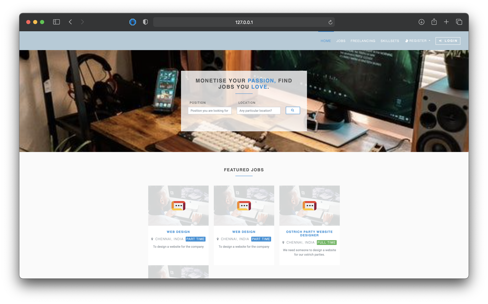
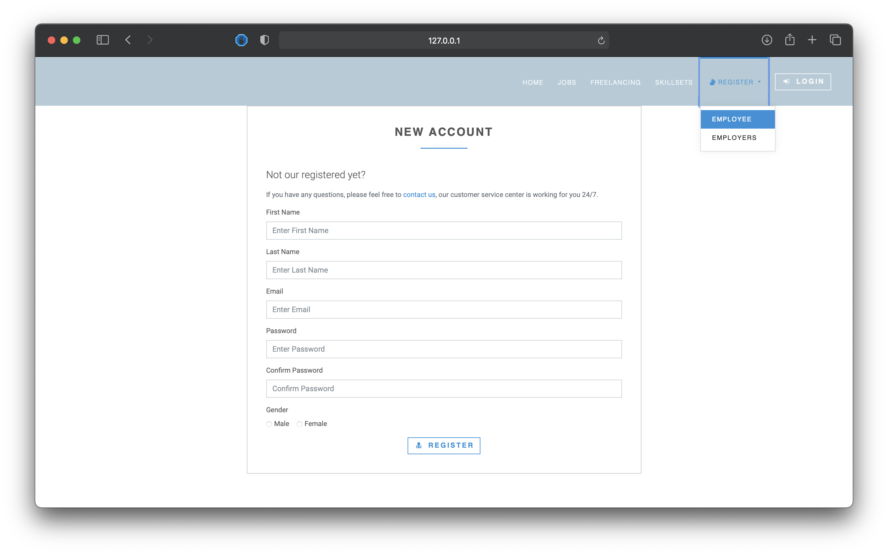
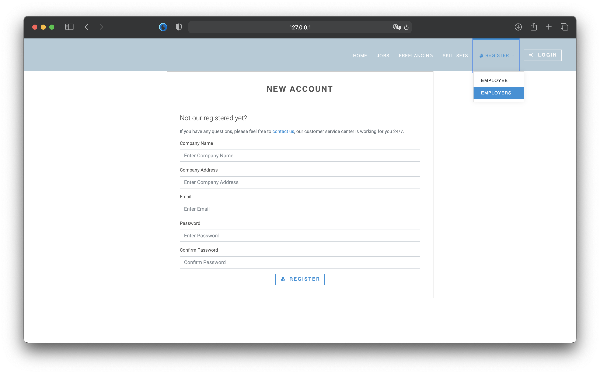
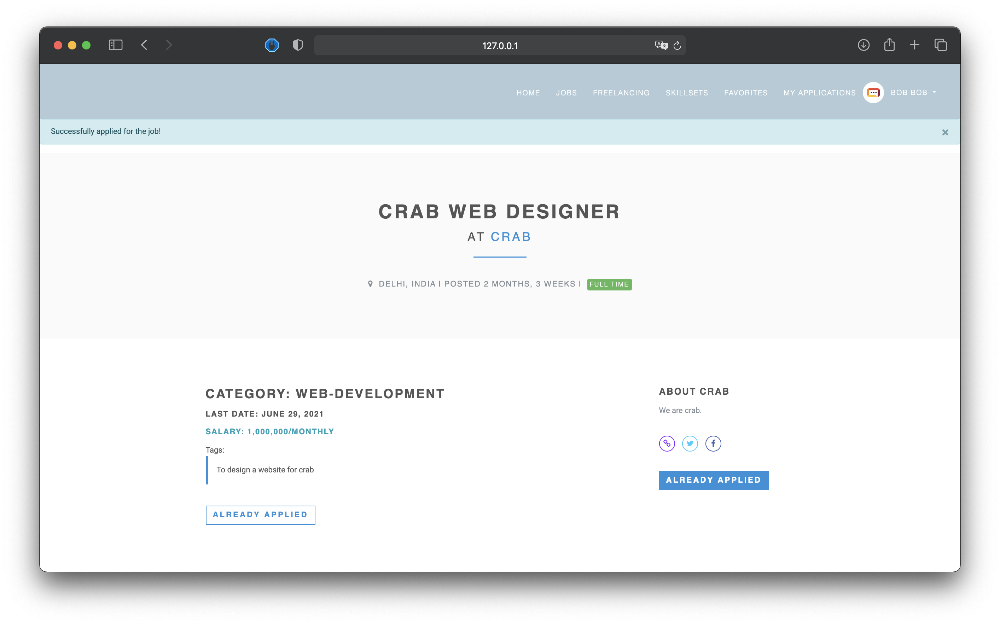
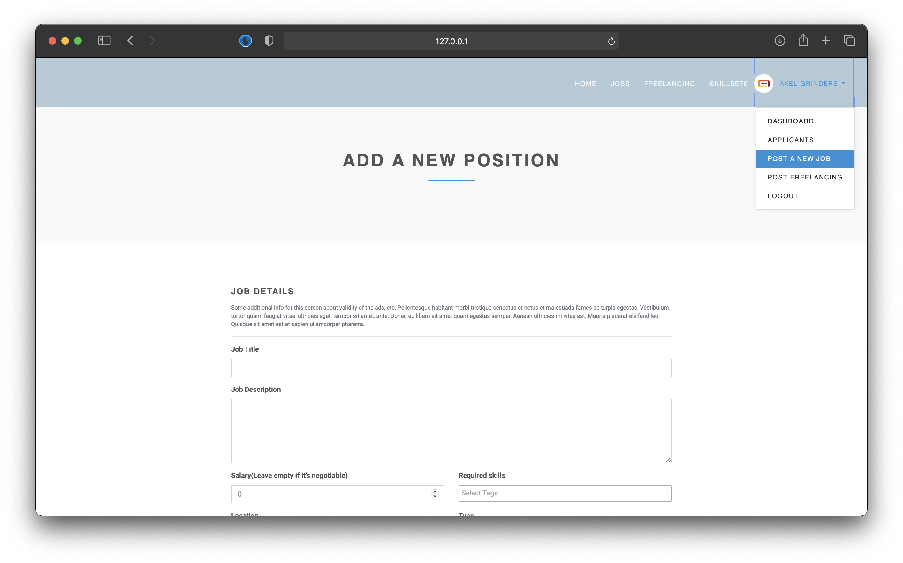
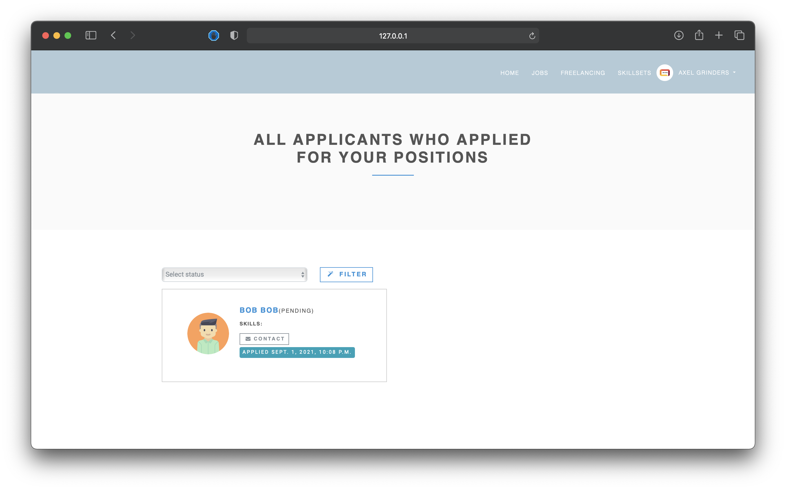
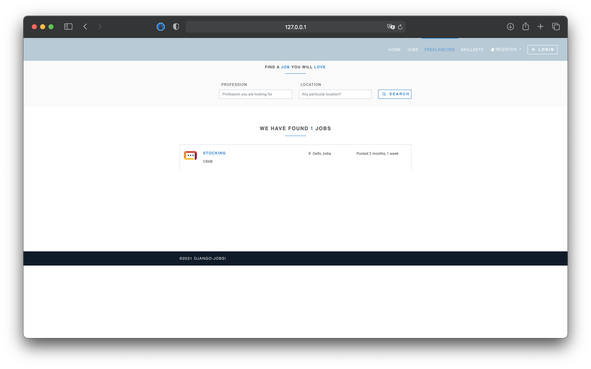
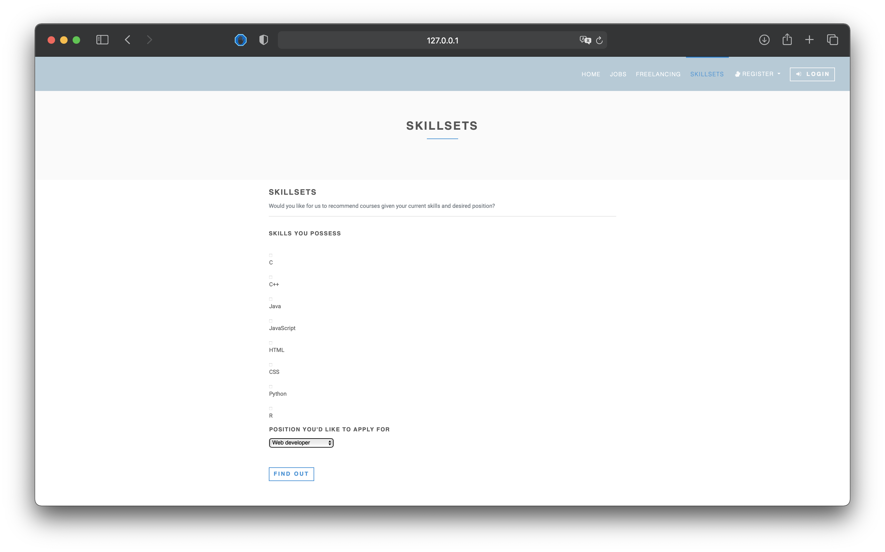
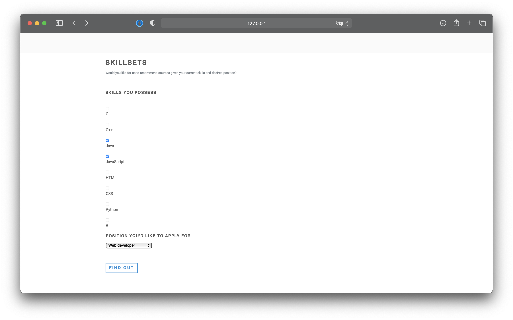
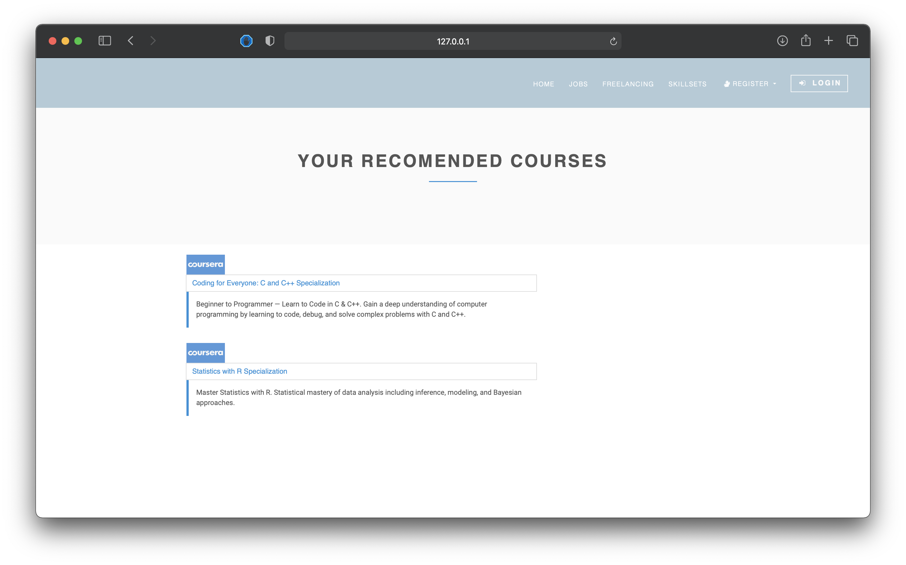

<!-- PROJECT LOGO -->
<br />
<p align="center">
  <a href="https://github.com/github_username/repo_name">
    
  </a>

  <h3 align="center">Recruit Pursuit</h3>

  <p align="center">
    A website to help differently abled people find job opportunities
</p>


<!-- TABLE OF CONTENTS -->
<details open="open">
  <summary><h2 style="display: inline-block">Table of Contents</h2></summary>
  <ol>
    <li>
      <a href="#about-the-project">About The Project</a>
      <ul>
        <li><a href="#built-with">Built With</a></li>
      </ul>
    </li>
    <li>
      <a href="#getting-started">Getting Started</a>
      <ul>
        <li><a href="#installation">Installation</a></li>
      </ul>
    </li>
    <li><a href="#usage">Usage</a></li>
    <li><a href="#contributing">Contributing</a></li>
    <li><a href="#license">License</a></li>
  </ol>
</details>


<!-- ABOUT THE PROJECT -->
## About The Project

This project started with 4 college kids trying to make the world a better place. Recruit Pursuit is a Job Recruitment website for the specific demographic of the differently abled that gives them equal opprtunities, so that it no longer matters what you look like, where you come from, or what you do for a living. All that matters is that we continue to fan the flame of humanity by living our lives as the ultimate creative expression of who we really are and what we want to be. 
The greatest man that you can be is a great man. But if you tell yourself, "If it wasn't for my handicap, I would be a greater man," now you have something worse than a handicap. You have an excuse. A handicap is an external thing, an indifferent. But an excuse is a handicap of character. 

### Built With

* [Bootstrap](https://getbootstrap.com)
* [JQuery](https://jquery.com)
* [Django](https://www.djangoproject.com)
* [Python](https://www.python.org)


<!-- GETTING STARTED -->
## Getting Started

To get a local copy up and running follow these simple steps.

### Installation

Clone the repo
   ```sh
   git clone https://github.com/Aron-R/Recruit-pursuit.git
   ```

1. Create a virtual environment

    `virtualenv venv`

    Or

    `python3.8 -m venv venv`

2. Activate it

    `source venv/bin/activate`

3. Clone the repository and install the packages in the virtual env:

    `pip install -r requirements.txt`

4. Add `.env` file.

    `cp .env.dev.sample .env`

5. Add Github client ID and client secret in the `.env` file

#### Run

1.With the venv activate it, execute:

    python manage.py collectstatic

*Note* : Collect static is not necessary when debug is True (in dev mode)

2. Create initial database:

    `python manage.py migrate`


3. Load demo data (optional):

    `python manage.py loaddata fixtures/app_name_initial_data.json --app app.model_name`

4. Run server:

    `python manage.py runserver`


#### Run test:
``python manage.py test``

#### To dump data:
``python manage.py dumpdata --format=json --indent 4 app_name > app_name/fixtures/app_name_initial_data.json``


<!-- USAGE EXAMPLES -->
## Usage

### Home page


### Recruitment Module 

First the user registers an account. There are 2 types of accounts,an employee account and an employer account. 




The employee account allows you to apply for jobs 


The employer account allows you to create job postings or freelance jobs


And accept job applications for positions you've made job postings for


### Freelancing module
The freelancing module works the same as the recruitment module but freelancing jobs are one time gigs 


### Skillsets Module
The skillsets modules suggest courses that you can find to further your skills





<!-- CONTRIBUTING -->
## Contributing

Follow these [Contributing Guidlines](./docs/Contribution.md) while Contributing to this Repository.

<!-- LICENSE -->
## License

Distributed under the MIT License. See `LICENSES` for more information.

